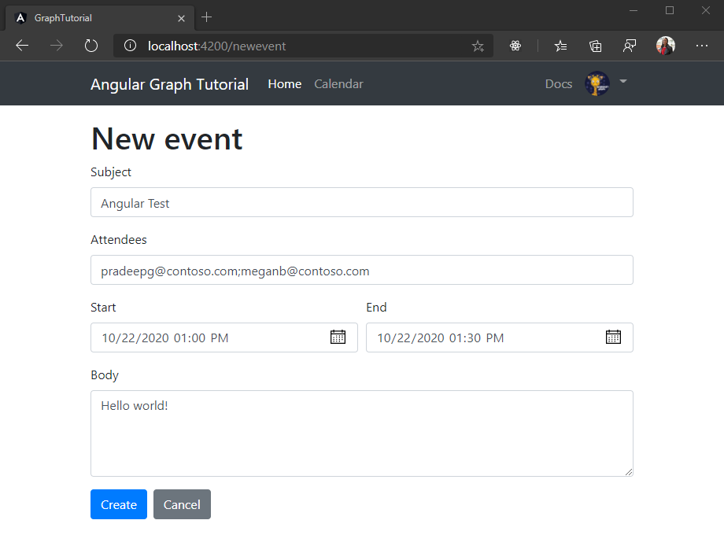

<!-- markdownlint-disable MD002 MD041 -->

このセクションでは、ユーザーの予定表にイベントを作成する機能を追加します。

1. /Src/app/graph.service.ts を開き、次の関数をクラスに追加します **。** `GraphService`

    :::code language="typescript" source="../demo/graph-tutorial/src/app/graph.service.ts" id="AddEventSnippet":::

## <a name="create-a-new-event-form"></a>新しいイベントフォームを作成する

1. フォームを表示する角度コンポーネントを作成し、この新しい関数を呼び出します。 CLI で次のコマンドを実行します。

    ```Shell
    ng generate component new-event
    ```

1. コマンドが完了したら、/src/app/app-routing.module.ts の配列にコンポーネントを追加します `routes` **。**

    ```typescript
    import { NewEventComponent } from './new-event/new-event.component';

    const routes: Routes = [
      { path: '', component: HomeComponent },
      { path: 'calendar', component: CalendarComponent },
      { path: 'newevent', component: NewEventComponent },
    ];
    ```

1. **/Src/app/new-event**という名前のディレクトリに新しいファイルを**作成し、** 次のコードを追加します。

    :::code language="typescript" source="../demo/graph-tutorial/src/app/new-event/new-event.ts" id="NewEventSnippet":::

    このクラスは、新しいイベントフォームのモデルとして機能します。

1. /Src/app/new-event/new-event.component.ts を開き、その内容を次のコードで置き換えます **。**

    :::code language="typescript" source="../demo/graph-tutorial/src/app/new-event/new-event.component.ts" id="NewEventComponentSnippet":::

1. **/Src/app/new-event/new-event.component.html**を開き、その内容を次のコードで置き換えます。

    :::code language="html" source="../demo/graph-tutorial/src/app/new-event/new-event.component.html" id="NewEventFormSnippet":::

1. 変更を保存し、アプリを更新します。 [カレンダー] ページの [ **New event** ] ボタンを選択し、フォームを使用してユーザーの予定表にイベントを作成します。

    
